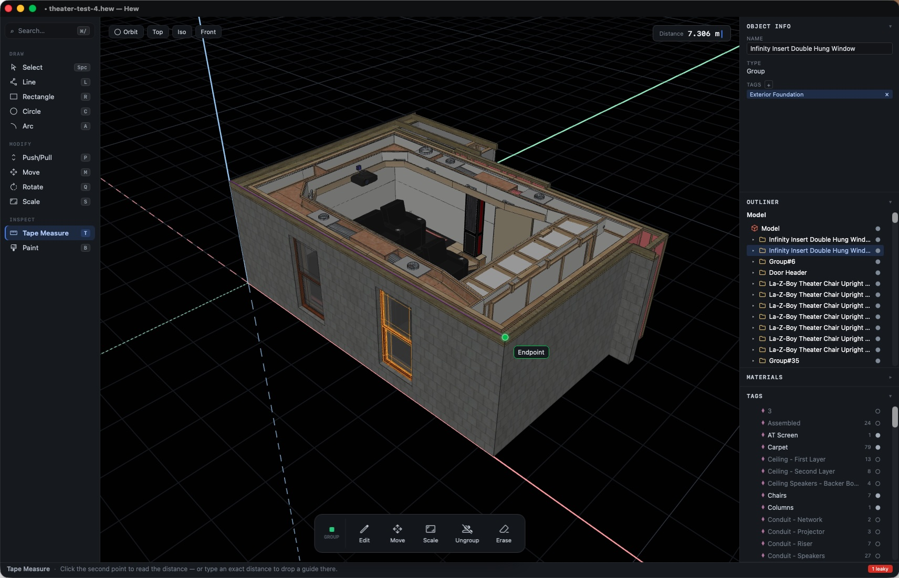

<p align="center">
  
</p>

<p align="center">
  The intuitive, Open Source, cross-platform, solids-first 3D modeler,
  pairing SketchUp-style direct modeling with watertight solid objects.
  And it's free!
</p>

<p align="center">
  <a href="https://hew3d.com/download">Download</a> ·
  <a href="https://app.hew3d.com">Run in the browser</a> ·
  <a href="https://hew3d.com/learn">User guide</a> ·
  <a href="https://hew3d.com">hew3d.com</a>
</p>

<p align="center">
  
</p>

---

Hew keeps the interaction model that made SketchUp approachable — draw on faces,
push/pull, pervasive inference snapping, even the same key bindings — and puts
it on top of a stricter foundation:

- **Extruding a closed profile creates a discrete Object.** Objects are
  watertight solids by construction and never weld together implicitly.
- **Combining Objects is always explicit** — a boolean union or merge you
  ask for, never a side effect of geometry touching.
- **Inside an Object, sticky geometry applies**: drawing an edge across a
  face splits it, closed coplanar loops become faces, faces push/pull.
- **No silent repair.** Operations that would produce invalid topology fail
  with a typed error instead of quietly "fixing" your model.
- **An open native format.** `.hew` files are a documented zip container —
  JSON manifest plus binary geometry buffers. See
  [docs/HEW_FILE_FORMAT.md](docs/HEW_FILE_FORMAT.md).

## Get Hew

Native desktop apps for macOS, Windows, and Linux — the recommended way to
use Hew — are on the [download page](https://hew3d.com/download) and the
[releases page](https://github.com/hew3d/hew/releases); desktop builds
update themselves in place. The same app also runs in any WebGL2-capable
browser at [app.hew3d.com](https://app.hew3d.com), with nothing to install.

See [docs/ROADMAP.md](docs/ROADMAP.md) for what's shipped and what's
planned.

## Highlights

- Drawing tools (line, rectangle, circle, arc) with on-face sketching,
  guides, and a measurements box that accepts typed, unit-aware input
- Push/pull with a live swept-solid preview; move, rotate (arbitrary axis),
  and scale with inference locking
- Boolean union, subtract, and intersect between solids
- Materials with texturing, per-face painting, and translucency
- Tags, an object tree, and per-Object solid/watertight reporting
- SketchUp 2017 keyboard shortcuts
- Import: SketchUp `.skp` (2017), COLLADA `.dae`, glTF — with names,
  hierarchy, materials, and tags preserved where the format carries them
- Export: glTF, STL — see [docs/INTEROP.md](docs/INTEROP.md)
- Autosave and crash recovery, structured debug logging, and deterministic
  session record/replay ([docs/DIAGNOSTICS.md](docs/DIAGNOSTICS.md))

## Architecture in one paragraph

The geometry kernel — half-edge meshes, Objects, booleans, undo,
serialization — is pure Rust with no UI, I/O, or network dependencies,
compiled to WebAssembly and run inside the webview on every platform,
desktop included. The UI is a single TypeScript + React codebase rendering
through three.js on a WebGL2 baseline. The desktop shell is Tauri; the web
shell is a static build of the same app. The full picture, including the
data model and the reasoning behind these choices, is in
[docs/ARCHITECTURE.md](docs/ARCHITECTURE.md).

## Building from source

Prerequisites: Rust (version pinned by `rust-toolchain.toml`), `wasm-pack`,
Node.js with `pnpm`, and for the desktop shell the
[Tauri platform prerequisites](https://tauri.app/start/prerequisites/).

```sh
# Build and test everything the verification gate covers
scripts/verify.sh

# Run the app in a browser
pnpm --dir app dev

# Run the desktop shell
pnpm --dir shells/tauri dev
```

Both `dev` and `build` compile the Rust kernel to WASM automatically,
rebuilding only when the kernel sources change. To build it on its own
(or if `wasm-pack` isn't on your `PATH` and you want to run it manually):

```sh
wasm-pack build crates/wasm-api --target web --out-dir ../../app/src/wasm/pkg
```

## Documentation

| Document | What it covers |
| --- | --- |
| [docs/ARCHITECTURE.md](docs/ARCHITECTURE.md) | Data model, kernel design, crate topology |
| [docs/DEVELOPMENT.md](docs/DEVELOPMENT.md) | Contributor guide: setup, rules, testing |
| [docs/HEW_FILE_FORMAT.md](docs/HEW_FILE_FORMAT.md) | The open `.hew` file format specification |
| [docs/INTEROP.md](docs/INTEROP.md) | Import/export formats and their limits |
| [docs/DIAGNOSTICS.md](docs/DIAGNOSTICS.md) | Debug logs, session recording, bug reports |
| [docs/ROADMAP.md](docs/ROADMAP.md) | Shipped features and planned work |

## Contributing

Contributions are welcome — see [CONTRIBUTING.md](CONTRIBUTING.md). Note
the project's licensing wall: nothing derived from the SketchUp SDK may
enter this repository or its dependency chain. SketchUp import is powered
by [OpenSKP](https://github.com/hew3d/openskp), a clean-room reader.

## License

Hew is licensed under the [GNU AGPL-3.0-only](LICENSE), together with the
[Hew Plugin API Exception](LICENSE-EXCEPTION) — an additional permission
that lets you write and distribute closed-source plugins, as long as they
interact with Hew solely through the documented Plugin API. The core stays
copyleft, including over network use; the plugin ecosystem is open to
commercial authors.

SketchUp is a trademark of Trimble Inc. This project is independent of
and not affiliated with Trimble in any possible way